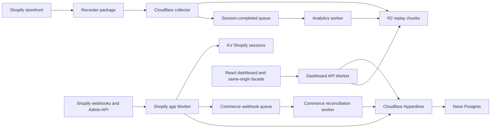

# System architecture

PathMinty begins as a modular monolith in one repository, deployed in a few shapes that
match their workloads.

## Deployment boundaries

### Shopify app Worker

A Cloudflare Worker using Shopify's official React Router package with Cloudflare's
React Router runtime. It owns installation, OAuth, webhook verification, billing,
extension configuration, and secure handoff to the standalone dashboard. Its embedded UI
ships through Workers Assets.

Shopify's official Cloudflare KV adapter stores installation/session state. Merchant,
order, refund, and analytical facts remain in Neon through Hyperdrive. Verified commerce
webhooks are acknowledged quickly and processed through a dedicated queue.

It is intentionally not generated until a new Shopify app exists. Reusing another app's
API key or secret would bind PathMinty to the wrong Shopify application.

### Collector

A very small Cloudflare Worker. It validates a capped batch, verifies its tenant-scoped
storefront token, stores the batch in R2 under a sequence+batchId key, and enqueues a
session-summary job for **every** accepted batch (not only final flushes).

It never performs replay analysis in the request path and never logs replay bodies.

### Analytics worker

A Cloudflare Queue consumer. It rewrites the R2 session summary and manifest after each
batch so active sessions appear quickly. Summaries derive clicks, hover samples, routes,
viewport metadata, and `hasFullSnapshot` from rrweb (or legacy json) payloads. Heatmap
aggregation and reconstruction readiness checks live in `@pathminty/analytics`.

### Dashboard and dashboard API

The dashboard SPA is deployed with Workers Assets. Its small Worker facade forwards
`/v1/*` to the independent dashboard API through a Cloudflare service binding. Browser
traffic therefore stays on one origin, so merchant authentication does not depend on
third-party cookies. Analytical traffic remains isolated from collection.

Worker-to-Postgres connections go through Hyperdrive.

## Storage ownership

| Store    | Owns                                                         | Must not own                         |
| -------- | ------------------------------------------------------------ | ------------------------------------ |
| R2       | compressed replay chunks and manifests                       | merchant identity or financial truth |
| Postgres | shops, users, sessions, orders, refunds, indexes, aggregates | raw replay event streams             |
| KV       | Shopify installation and authentication sessions             | analytical facts or replay payloads  |
| Queue    | short-lived coarse jobs                                      | durable source-of-truth data         |

## Migration seams

Vendor calls sit at the edge of a package:

- R2 implements `ReplayObjectStore`;
- Cloudflare Queues implements `SessionJobPublisher`;
- Postgres implements repositories from the domain packages;
- rrweb (`@rrweb/record`) implements the storefront recorder driver;
- Shopify payloads are normalized before entering the domain.

This lets R2 move to S3, Queues to Redpanda/SQS, Neon to another Postgres, or rrweb to a
fork without changing product-level contracts.

## Non-negotiable invariants

- Every external payload is validated.
- Every tenant record carries `shopId`.
- Money uses integer minor units and ISO currency.
- Replay object writes are idempotent by deterministic key.
- Queue consumers are safe under duplicate delivery.
- Input masking defaults to deny.
- Raw IP addresses and replay bodies never enter logs.
